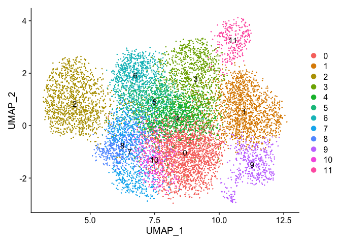
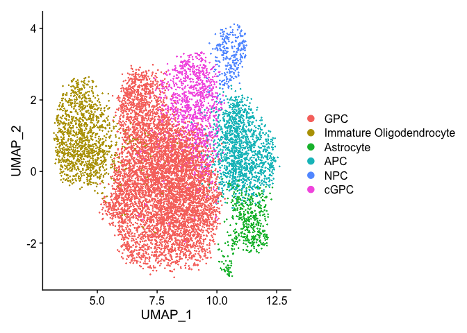
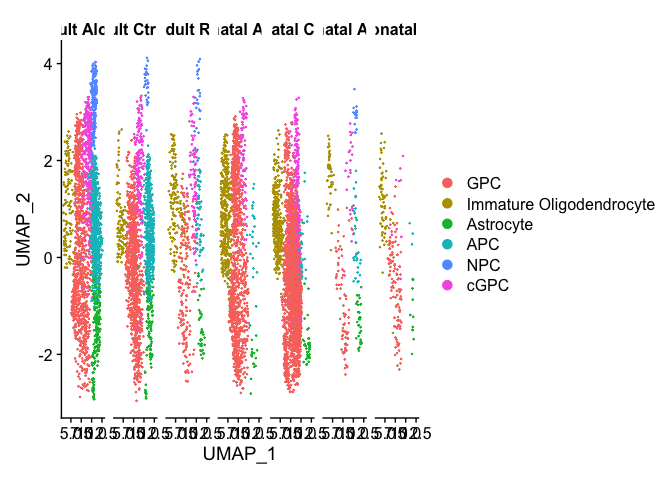

Processing and Differential Expression of HD and Ctr competition striata
================
John Mariani
12/6/2022

``` r
library(Seurat)
library(scPlottingTools)
library(ggplot2)
library(tidyr)
library(FSA)
library(dplyr)
library(MAST)
library(FSA)
library(plyr)
library(xlsx)
library(patchwork)
library(ggplot2)
library(scales)


options(future.globals.maxSize = 16000 * 1024^2)

`%not in%` <- function(x, table) is.na(match(x, table, nomatch = NA_integer_))


labelFont = 6
titleFont = 8

#### Make sig
deFilter <- function(de, fdrCutoff = 0.05, logFCcutoff = .15){
  temp <- de[de$FDR < fdrCutoff & abs(de$logFC) > logFCcutoff,]
  #temp <- temp[complete.cases(temp),]
  temp <- temp[temp$Gene %not in% c("EGFP", "mCherry"),]
  names(temp) <- c("Gene", "PVal", "FDR", "Log2FC")
  temp <- temp[order(temp$FDR, decreasing = F),]
  return(temp)
}


writeDE <- function(de){
  temp <- de
  temp$Gene <- row.names(temp)
  temp <- temp[,c(4,1,2,3)]
  write.table(temp,paste0("DE/All/", deparse(substitute(de)), ".txt"), row.names = F, quote = F, sep = "\t")
}


writeSig <- function(de){
  write.table(de,paste0("DE/Sig/", deparse(substitute(de)), ".txt"), row.names = F, quote = F, sep = "\t")
  
}


readDE <- function(de){
  read.delim(paste0("DE/All/", de, ".txt"))
}


readSig <- function(de){
  read.delim(paste0("DE/Sig/", de, ".txt"))
}
```

# Load data and add details from scVI/scanPY

``` r
merged <- readRDS("RDS/HD_Competition_Preprocessed.rds")
DefaultAssay(merged) <- "RNA"
dim(merged)
```

    ## [1] 38743 10410

``` r
merged <- NormalizeData(merged)
merged <- ScaleData(merged)
```

    ## Centering and scaling data matrix

``` r
merged <- FindVariableFeatures(merged)

# Run these to jam SCVI UMAP and leiden clusters in
merged <- RunPCA(merged, verbose = FALSE)
merged <- FindNeighbors(merged, dims = 1:50, verbose = FALSE)
merged <- RunUMAP(merged, dims = 1:50, verbose = FALSE)
```

    ## Warning: The default method for RunUMAP has changed from calling Python UMAP via reticulate to the R-native UWOT using the cosine metric
    ## To use Python UMAP via reticulate, set umap.method to 'umap-learn' and metric to 'correlation'
    ## This message will be shown once per session

``` r
merged <- FindClusters(merged, verbose = FALSE, resolution = .2)


umapEmbeddings <- read.csv("data_for_import/umapEmbeddings.csv", header = F)
row.names(umapEmbeddings) <- Cells(merged)
names(umapEmbeddings) <- c("UMAP_1", "UMAP_2")
merged@reductions$umap@cell.embeddings <- as.matrix(umapEmbeddings)

leiden_clusters <- read.csv("data_for_import/leidenClusters.csv")
merged$leiden_clusters <- factor(leiden_clusters$leiden_scVI, levels = 0:11)

Idents(merged) <- merged$leiden_clusters


DimPlot(merged, label = T)
```

<!-- -->

``` r
merged <- RenameIdents(merged, "3" = "cGPC")
merged <- RenameIdents(merged, "11" = "NPC")
merged <- RenameIdents(merged, "1" = "APC")
merged <- RenameIdents(merged, "9" = "Astrocyte")
merged <- RenameIdents(merged, "2" = "Immature Oligodendrocyte")
merged <- RenameIdents(merged, "0" = "GPC")
merged <- RenameIdents(merged, "4" = "GPC")
merged <- RenameIdents(merged, "5" = "GPC")
merged <- RenameIdents(merged, "6" = "GPC")
merged <- RenameIdents(merged, "7" = "GPC")
merged <- RenameIdents(merged, "8" = "GPC")
merged <- RenameIdents(merged, "10" = "GPC")


merged$CellType <- Idents(merged)

DimPlot(merged)
```

<!-- -->

# Cell Cycle Scoring

``` r
s.genes <- cc.genes$s.genes
g2m.genes <- cc.genes$g2m.genes

#MLF1IP
s.genes[s.genes %not in% merged@assays$RNA@counts@Dimnames[[1]]] <- "CENPU"
s.genes[s.genes %not in% merged@assays$RNA@counts@Dimnames[[1]]]
```

    ## character(0)

``` r
#FAM64A HN1
g2m.genes[g2m.genes %not in% merged@assays$RNA@counts@Dimnames[[1]]] <- c("PIMREG", "JPT1")
g2m.genes[g2m.genes %not in% merged@assays$RNA@counts@Dimnames[[1]]]
```

    ## character(0)

``` r
merged <- CellCycleScoring(merged, s.features = s.genes, g2m.features = g2m.genes, set.ident = F)
```

# Update labeling

``` r
metaMerged <- merged@meta.data
metaMerged$otherGroup <- paste(metaMerged$Cell, metaMerged$Transplant, metaMerged$Paradigm, sep = " ")
unique(metaMerged$otherGroup)
```

    ## [1] "G19 Adult Alone Late"    "G19 Adult CtrlRescue"   
    ## [3] "G19 Adult Rescue"        "G19 Neonatal Alone Late"
    ## [5] "G19 Neonatal CtrlRescue" "G20 Neonatal Alone Late"
    ## [7] "G20 Neonatal Rescue"

``` r
table(metaMerged$SampleName)
```

    ## 
    ##       G19 EGFP Adult Alone Late 1       G19 EGFP Adult CtrlRescue 3 
    ##                              1910                              1871 
    ##    G19 mCherry Adult Alone Late 7       G19 mCherry Adult Rescue 10 
    ##                               734                               306 
    ##       G19 mCherry Adult Rescue 11        G19 mCherry Adult Rescue 9 
    ##                               136                               106 
    ## G19 mCherry Neonatal Alone Late 2 G19 mCherry Neonatal CtrlRescue 3 
    ##                              1661                              3246 
    ##    G20 EGFP Neonatal Alone Late 8       G20 EGFP Neonatal Rescue 10 
    ##                               234                               149 
    ##       G20 EGFP Neonatal Rescue 11 
    ##                                57

``` r
tempLabels <- unique(metaMerged$otherGroup)
names(tempLabels) <- c("Young WT Ctr", "Young WT Isograft", "Young WT Allograft", "Old WT Ctr", "Old WT Isograft", "Old HD Ctr", "Old HD Allograft")
metaMerged$newLabel <- plyr::mapvalues(metaMerged$otherGroup, tempLabels, names(tempLabels))
metaMerged$newLabel <- factor(metaMerged$newLabel, levels = c("Young WT Ctr", "Young WT Isograft", "Young WT Allograft", "Old WT Ctr", "Old WT Isograft", "Old HD Ctr", "Old HD Allograft"))


merged@meta.data <- metaMerged

DimPlot(merged, split.by = "otherGroup")
```

<!-- -->

``` r
DimPlot(merged, split.by = "newLabel")
```

<!-- -->

# GPC Differential expression with MAST

``` r
merged$ngeneson <- scale(merged$nFeature_RNA)

##### Run if you haven't computed DE yet

### Make GPC
GPC <- subset(merged, subset = CellType %in% c("GPC"))

data.use <- GetAssayData(object = GPC, slot = "data")
fdat <- data.frame(rownames(x = data.use))
colnames(x = fdat)[1] <- "primerid"
rownames(x = fdat) <- fdat[,1]
cData <- as.data.frame(GPC@meta.data)
cData$wellKey <- row.names(cData)


GPC.sca <- MAST::FromMatrix(
  exprsArray = as.matrix(x = data.use),
  check_sanity = T,
  cData = cData,
  fData = fdat)
```

    ## Warning in asMethod(object): sparse->dense coercion: allocating vector of size
    ## 1.7 GiB

    ## Assuming data assay in position 1, with name et is log-transformed.

``` r
genes.keep <- freq(GPC.sca) > .03
GPC.sca <- GPC.sca[genes.keep,]
dim(GPC.sca)
```

    ## [1] 12213  5998

``` r
#### DE for all

modelMAST <- as.formula(
  object = "~0+ngeneson+otherGroup")


ZLM <-MAST::zlm(formula = modelMAST, sca = GPC.sca, useContinuousBayes = T)
```

    ## 
    ## Done!

``` r
saveRDS(ZLM, "RDS/ZLM.rds")


runLR <- function(z, lrContrast, contrast0, contrast1){
  temp <- as.data.frame(lrTest(z, as.matrix(lrContrast)))
  temp$FDR <- p.adjust(p = temp$`hurdle.Pr(>Chisq)`, 'fdr')
  temp <- temp[,9:10]
  log2FC <- getLogFC(z, contrast0 = contrast0, contrast1 = contrast1)
  temp$logFC <- log2FC$logFC
  return(temp)
}

colnames(ZLM@coefD)
```

    ## [1] "ngeneson"                          "otherGroupG19 Adult Alone Late"   
    ## [3] "otherGroupG19 Adult CtrlRescue"    "otherGroupG19 Adult Rescue"       
    ## [5] "otherGroupG19 Neonatal Alone Late" "otherGroupG19 Neonatal CtrlRescue"
    ## [7] "otherGroupG20 Neonatal Alone Late" "otherGroupG20 Neonatal Rescue"

``` r
#otherGroupG19 Adult Alone Late vs otherGroupG19 Neonatal Alone Late
WT.Adult.Alone.vs.WT.Neonatal.Alone <- runLR(ZLM, c(0,1,0,0,-1,0,0,0), contrast0 = c(0,0,0,0,1,0,0,0), contrast1 = c(0,1,0,0,0,0,0,0))
```

    ## Refitting on reduced model...

    ## 
    ## Done!

``` r
#otherGroupG19 Adult CtrlRescue vs otherGroupG19 Adult Alone Late
WT.Adult.CtrlRescue.vs.WT.Adult.Alone <- runLR(ZLM, c(0,-1,1,0,0,0,0,0), contrast0 = c(0,1,0,0,0,0,0,0), contrast1 = c(0,0,1,0,0,0,0,0))
```

    ## Refitting on reduced model...
    ## 
    ## Done!

``` r
#otherGroupG19 Adult Alone Late vs otherGroupG19 Neonatal CtrlRescue
WT.Adult.CtrlRescue.vs.WT.Neonatal.CtrlRescue <- runLR(ZLM, c(0,0,1,0,0,-1,0,0), contrast0 = c(0,0,0,0,0,1,0,0), contrast1 = c(0,0,1,0,0,0,0,0))
```

    ## Refitting on reduced model...
    ## 
    ## Done!

``` r
#otherGroupG19 Neonatal CtrlRescue vs otherGroupG19 Neonatal Alone Late
WT.Neonatal.CtrlRescue.vs.WT.Neonatal.Alone <- runLR(ZLM, c(0,0,0,0,-1,1,0,0), contrast0 = c(0,0,0,0,1,0,0,0), contrast1 = c(0,0,0,0,0,1,0,0))
```

    ## Refitting on reduced model...
    ## 
    ## Done!

``` r
##### G20 vs G19 comparison

#otherGroupG19 Adult Alone Late vs otherGroupG20 Neonatal Alone Lat
WT.Adult.Alone.vs.HD.Neonatal.Alone <- runLR(ZLM, c(0,1,0,0,0,0,-1,0), contrast0 = c(0,0,0,0,0,0,1,0), contrast1 = c(0,1,0,0,0,0,0,0))
```

    ## Refitting on reduced model...
    ## 
    ## Done!

``` r
#otherGroupG19 Adult Rescue vs otherGroupG19 Adult Alone Late
WT.Adult.Rescue.vs.WT.Adult.Alone <- runLR(ZLM, c(0,-1,0,1,0,0,0,0), contrast0 = c(0,1,0,0,0,0,0,0), contrast1 = c(0,0,0,1,0,0,0,0))
```

    ## Refitting on reduced model...
    ## 
    ## Done!

``` r
#otherGroupG19 Adult Rescue vs otherGroupG20 Neonatal Rescue
WT.Adult.Rescue.vs.HD.Neonatal.Rescue <- runLR(ZLM, c(0,0,0,1,0,0,0,-1), contrast0 = c(0,0,0,0,0,0,0,1), contrast1 = c(0,0,0,1,0,0,0,0))
```

    ## Refitting on reduced model...
    ## 
    ## Done!

``` r
#otherGroupG20 Neonatal Rescue vs otherGroupG20 Neonatal Alone Late
HD.Neonatal.Rescue.vs.HD.Neonatal.Alone <- runLR(ZLM, c(0,0,0,0,0,0,-1,1), contrast0 = c(0,0,0,0,0,0,1,0), contrast1 = c(0,0,0,0,0,0,0,1))
```

    ## Refitting on reduced model...
    ## 
    ## Done!

``` r
writeDE(WT.Adult.Alone.vs.HD.Neonatal.Alone)
writeDE(WT.Adult.Rescue.vs.WT.Adult.Alone)
writeDE(WT.Adult.Rescue.vs.HD.Neonatal.Rescue)
writeDE(HD.Neonatal.Rescue.vs.HD.Neonatal.Alone)
writeDE(WT.Adult.Alone.vs.WT.Neonatal.Alone)
writeDE(WT.Adult.CtrlRescue.vs.WT.Adult.Alone)
writeDE(WT.Adult.CtrlRescue.vs.WT.Neonatal.CtrlRescue)
writeDE(WT.Neonatal.CtrlRescue.vs.WT.Neonatal.Alone)

# Load DE results if already run
WT.Adult.Alone.vs.HD.Neonatal.Alone <- readDE("WT.Adult.Alone.vs.HD.Neonatal.Alone")
WT.Adult.Rescue.vs.WT.Adult.Alone <- readDE("WT.Adult.Rescue.vs.WT.Adult.Alone")
WT.Adult.Rescue.vs.HD.Neonatal.Rescue <- readDE("WT.Adult.Rescue.vs.HD.Neonatal.Rescue")
HD.Neonatal.Rescue.vs.HD.Neonatal.Alone <- readDE("HD.Neonatal.Rescue.vs.HD.Neonatal.Alone")
WT.Adult.Alone.vs.WT.Neonatal.Alone <- readDE("WT.Adult.Alone.vs.WT.Neonatal.Alone")
WT.Adult.CtrlRescue.vs.WT.Adult.Alone <- readDE("WT.Adult.CtrlRescue.vs.WT.Adult.Alone")
WT.Adult.CtrlRescue.vs.WT.Neonatal.CtrlRescue <- readDE("WT.Adult.CtrlRescue.vs.WT.Neonatal.CtrlRescue")
WT.Neonatal.CtrlRescue.vs.WT.Neonatal.Alone <- readDE("WT.Neonatal.CtrlRescue.vs.WT.Neonatal.Alone")

# Filter for significance and FC
WT.Adult.Alone.vs.HD.Neonatal.Alone.sig <- deFilter(WT.Adult.Alone.vs.HD.Neonatal.Alone)
WT.Adult.Rescue.vs.WT.Adult.Alone.sig <- deFilter(WT.Adult.Rescue.vs.WT.Adult.Alone)
WT.Adult.Rescue.vs.HD.Neonatal.Rescue.sig <- deFilter(WT.Adult.Rescue.vs.HD.Neonatal.Rescue)
HD.Neonatal.Rescue.vs.HD.Neonatal.Alone.sig <- deFilter(HD.Neonatal.Rescue.vs.HD.Neonatal.Alone)
WT.Adult.Alone.vs.WT.Neonatal.Alone.sig <- deFilter(WT.Adult.Alone.vs.WT.Neonatal.Alone)
WT.Adult.CtrlRescue.vs.WT.Adult.Alone.sig <- deFilter(WT.Adult.CtrlRescue.vs.WT.Adult.Alone)
WT.Adult.CtrlRescue.vs.WT.Neonatal.CtrlRescue.sig <- deFilter(WT.Adult.CtrlRescue.vs.WT.Neonatal.CtrlRescue)
WT.Neonatal.CtrlRescue.vs.WT.Neonatal.Alone.sig <- deFilter(WT.Neonatal.CtrlRescue.vs.WT.Neonatal.Alone)


writeSig(WT.Adult.Alone.vs.HD.Neonatal.Alone.sig)
writeSig(WT.Adult.Rescue.vs.WT.Adult.Alone.sig)
writeSig(WT.Adult.Rescue.vs.HD.Neonatal.Rescue.sig)
writeSig(HD.Neonatal.Rescue.vs.HD.Neonatal.Alone.sig)
writeSig(WT.Adult.Alone.vs.WT.Neonatal.Alone.sig)
writeSig(WT.Adult.CtrlRescue.vs.WT.Adult.Alone.sig)
writeSig(WT.Adult.CtrlRescue.vs.WT.Neonatal.CtrlRescue.sig)
writeSig(WT.Neonatal.CtrlRescue.vs.WT.Neonatal.Alone.sig)
```

\#Export DE and logFC
information

``` r
WT.Adult.Alone.vs.HD.Neonatal.Alone.sig$Comparison <- "WT.Adult.Alone.vs.HD.Neonatal.Alone"
WT.Adult.Rescue.vs.WT.Adult.Alone.sig$Comparison <- "WT.Adult.Rescue.vs.WT.Adult.Alone"
WT.Adult.Rescue.vs.HD.Neonatal.Rescue.sig$Comparison <- "WT.Adult.Rescue.vs.HD.Neonatal.Rescue"
HD.Neonatal.Rescue.vs.HD.Neonatal.Alone.sig$Comparison <- "HD.Neonatal.Rescue.vs.HD.Neonatal.Alone"
WT.Adult.Alone.vs.WT.Neonatal.Alone.sig$Comparison <- "WT.Adult.Alone.vs.WT.Neonatal.Alone"
WT.Adult.CtrlRescue.vs.WT.Adult.Alone.sig$Comparison <- "WT.Adult.CtrlRescue.vs.WT.Adult.Alone"
WT.Adult.CtrlRescue.vs.WT.Neonatal.CtrlRescue.sig$Comparison <- "WT.Adult.CtrlRescue.vs.WT.Neonatal.CtrlRescue"
WT.Neonatal.CtrlRescue.vs.WT.Neonatal.Alone.sig$Comparison <- "WT.Neonatal.CtrlRescue.vs.WT.Neonatal.Alone"

WT.Adult.Alone.vs.HD.Neonatal.Alone$Comparison <- "WT.Adult.Alone.vs.HD.Neonatal.Alone"
WT.Adult.Rescue.vs.WT.Adult.Alone$Comparison <- "WT.Adult.Rescue.vs.WT.Adult.Alone"
WT.Adult.Rescue.vs.HD.Neonatal.Rescue$Comparison <- "WT.Adult.Rescue.vs.HD.Neonatal.Rescue"
HD.Neonatal.Rescue.vs.HD.Neonatal.Alone$Comparison <- "HD.Neonatal.Rescue.vs.HD.Neonatal.Alone"
WT.Adult.Alone.vs.WT.Neonatal.Alone$Comparison <- "WT.Adult.Alone.vs.WT.Neonatal.Alone"
WT.Adult.CtrlRescue.vs.WT.Adult.Alone$Comparison <- "WT.Adult.CtrlRescue.vs.WT.Adult.Alone"
WT.Adult.CtrlRescue.vs.WT.Neonatal.CtrlRescue$Comparison <- "WT.Adult.CtrlRescue.vs.WT.Neonatal.CtrlRescue"
WT.Neonatal.CtrlRescue.vs.WT.Neonatal.Alone$Comparison <- "WT.Neonatal.CtrlRescue.vs.WT.Neonatal.Alone"

allDE <- rbind(WT.Adult.Alone.vs.HD.Neonatal.Alone.sig,
               WT.Adult.Rescue.vs.WT.Adult.Alone.sig,
               WT.Adult.Rescue.vs.HD.Neonatal.Rescue.sig,
               HD.Neonatal.Rescue.vs.HD.Neonatal.Alone.sig,
               WT.Adult.Alone.vs.WT.Neonatal.Alone.sig,
               WT.Adult.CtrlRescue.vs.WT.Adult.Alone.sig,
               WT.Adult.CtrlRescue.vs.WT.Neonatal.CtrlRescue.sig,
               WT.Neonatal.CtrlRescue.vs.WT.Neonatal.Alone.sig)

allDE$abs <- abs(allDE$Log2FC)


unique(allDE$Comparison)
```

    ## [1] "WT.Adult.Alone.vs.HD.Neonatal.Alone"          
    ## [2] "WT.Adult.Rescue.vs.WT.Adult.Alone"            
    ## [3] "WT.Adult.Rescue.vs.HD.Neonatal.Rescue"        
    ## [4] "HD.Neonatal.Rescue.vs.HD.Neonatal.Alone"      
    ## [5] "WT.Adult.Alone.vs.WT.Neonatal.Alone"          
    ## [6] "WT.Adult.CtrlRescue.vs.WT.Adult.Alone"        
    ## [7] "WT.Adult.CtrlRescue.vs.WT.Neonatal.CtrlRescue"
    ## [8] "WT.Neonatal.CtrlRescue.vs.WT.Neonatal.Alone"

``` r
deRubric = data.frame(Comparison = unique(allDE$Comparison), 
                      Label = c("WT Ctr vs HD Ctr", "WT Allograft vs WT Ctr", "WT Allograft vs HD Allograft", "HD Allograft vs HD Ctr", "Young WT Ctr vs Aged WT Ctr", "Young WT Isograft vs Young WT Ctr", "Young WT Isograft vs Aged WT Isograft", "Aged WT Isograft vs Aged WT Ctr"),
                      Paradigm = c(rep("Allograft",4), rep("Isograft",4)))

deRubric$Label <- factor(deRubric$Label, levels = c("WT Ctr vs HD Ctr", "WT Allograft vs HD Allograft", "WT Allograft vs WT Ctr", "HD Allograft vs HD Ctr",
              "Young WT Ctr vs Aged WT Ctr", "Young WT Isograft vs Aged WT Isograft", "Young WT Isograft vs Young WT Ctr", "Aged WT Isograft vs Aged WT Ctr"))


allDE <- merge(allDE, deRubric, by.x = "Comparison", by.y = "Comparison")

allLogFC <- rbind(WT.Adult.Alone.vs.HD.Neonatal.Alone,
                  WT.Adult.Rescue.vs.WT.Adult.Alone,
                  WT.Adult.Rescue.vs.HD.Neonatal.Rescue,
                  HD.Neonatal.Rescue.vs.HD.Neonatal.Alone,
                  WT.Adult.Alone.vs.WT.Neonatal.Alone,
                  WT.Adult.CtrlRescue.vs.WT.Adult.Alone,
                  WT.Adult.CtrlRescue.vs.WT.Neonatal.CtrlRescue,
                  WT.Neonatal.CtrlRescue.vs.WT.Neonatal.Alone)

allLogFC <- merge(allLogFC, deRubric, by.x = "Comparison", by.y = "Comparison")


write.csv(deRubric, "data_for_import/deRubric.csv")
write.table(allDE, "DE/allDE.txt", sep = "\t", row.names = F, quote= F)
write.table(allLogFC, "DE/allLogFC.txt", sep = "\t", row.names = F, quote = F)
saveRDS(merged, "RDS/mergedUpdated.rds")
```

``` r
formatExtended <- function(sig){
  temp <- merge(sig, deRubric, by.x = "Comparison", by.y = "Comparison")
  temp <- temp[,2:6]
  names(temp)[[5]] <- "Comparison"
  return(temp)
}

temp <- formatExtended(WT.Adult.Rescue.vs.HD.Neonatal.Rescue.sig)
```

# Write out Extended data DE tables

``` r
# write.xlsx(formatExtended(WT.Adult.Alone.vs.HD.Neonatal.Alone.sig), "ExtendedDataTables/Extended Data Table 1-WT vs HD hGPC in competition DE genes and controls 4 tabs.xlsx", 
#            sheetName= "WT Ctr vs HD Ctr",
#            col.names=T, row.names=F, append=T)
# 
# write.xlsx(formatExtended(WT.Adult.Rescue.vs.HD.Neonatal.Rescue.sig), "ExtendedDataTables/Extended Data Table 1-WT vs HD hGPC in competition DE genes and controls 4 tabs.xlsx", 
#            sheetName= "WT Allograft vs HD Allograft",
#            col.names=T, row.names=F, append=T)
# 
# write.xlsx(formatExtended(WT.Adult.Rescue.vs.WT.Adult.Alone.sig), "ExtendedDataTables/Extended Data Table 1-WT vs HD hGPC in competition DE genes and controls 4 tabs.xlsx", 
#            sheetName= "WT Allograft vs WT Ctr",
#            col.names=T, row.names=F, append=T)
# 
# write.xlsx(formatExtended(HD.Neonatal.Rescue.vs.HD.Neonatal.Alone.sig), "ExtendedDataTables/Extended Data Table 1-WT vs HD hGPC in competition DE genes and controls 4 tabs.xlsx", 
#            sheetName= "HD Allograft vs HD Ctr",
#            col.names=T, row.names=F, append=T)
# 
# write.xlsx(formatExtended(WT.Adult.Alone.vs.WT.Neonatal.Alone.sig), "ExtendedDataTables/Extended Data Table 3-Isogenic Young vs Older-DE genes and controls 4 tabs.xlsx", 
#            sheetName= "Young WT Ctr vs Aged WT Ctr",
#            col.names=T, row.names=F, append=T)
# 
# write.xlsx(formatExtended(WT.Adult.CtrlRescue.vs.WT.Neonatal.CtrlRescue.sig), "ExtendedDataTables/Extended Data Table 3-Isogenic Young vs Older-DE genes and controls 4 tabs.xlsx", 
#            sheetName= "Young WT Isograft vs Aged WT Isograft",
#            col.names=T, row.names=F, append=T)
# 
# write.xlsx(formatExtended(WT.Adult.CtrlRescue.vs.WT.Adult.Alone.sig), "ExtendedDataTables/Extended Data Table 3-Isogenic Young vs Older-DE genes and controls 4 tabs.xlsx", 
#            sheetName= "Young WT Isograft vs Young WT Ctr",
#            col.names=T, row.names=F, append=T)
# 
# write.xlsx(formatExtended(WT.Neonatal.CtrlRescue.vs.WT.Neonatal.Alone.sig), "ExtendedDataTables/Extended Data Table 3-Isogenic Young vs Older-DE genes and controls 4 tabs.xlsx", 
#            sheetName= "Aged WT Isograft vs Aged WT Ctr",
#            col.names=T, row.names=F, append=T)
```

``` r
sessionInfo()
```

    ## R version 4.1.0 (2021-05-18)
    ## Platform: x86_64-apple-darwin17.0 (64-bit)
    ## Running under: macOS High Sierra 10.13.6
    ## 
    ## Matrix products: default
    ## BLAS:   /Library/Frameworks/R.framework/Versions/4.1/Resources/lib/libRblas.dylib
    ## LAPACK: /Library/Frameworks/R.framework/Versions/4.1/Resources/lib/libRlapack.dylib
    ## 
    ## locale:
    ## [1] en_US.UTF-8/en_US.UTF-8/en_US.UTF-8/C/en_US.UTF-8/en_US.UTF-8
    ## 
    ## attached base packages:
    ## [1] parallel  stats4    stats     graphics  grDevices utils     datasets 
    ## [8] methods   base     
    ## 
    ## other attached packages:
    ##  [1] scales_1.2.1                patchwork_1.1.1            
    ##  [3] xlsx_0.6.5                  plyr_1.8.6                 
    ##  [5] MAST_1.18.0                 SingleCellExperiment_1.14.1
    ##  [7] SummarizedExperiment_1.22.0 Biobase_2.52.0             
    ##  [9] GenomicRanges_1.44.0        GenomeInfoDb_1.28.1        
    ## [11] IRanges_2.26.0              S4Vectors_0.30.0           
    ## [13] BiocGenerics_0.38.0         MatrixGenerics_1.4.1       
    ## [15] matrixStats_0.60.0          dplyr_1.0.7                
    ## [17] FSA_0.9.1                   tidyr_1.1.3                
    ## [19] ggplot2_3.4.0               scPlottingTools_0.0.0.9000 
    ## [21] sp_1.5-0                    SeuratObject_4.1.2         
    ## [23] Seurat_4.0.3               
    ## 
    ## loaded via a namespace (and not attached):
    ##   [1] igraph_1.2.6           lazyeval_0.2.2         splines_4.1.0         
    ##   [4] listenv_0.8.0          scattermore_0.7        digest_0.6.27         
    ##   [7] htmltools_0.5.1.1      fansi_0.5.0            magrittr_2.0.1        
    ##  [10] tensor_1.5             cluster_2.1.2          ROCR_1.0-11           
    ##  [13] globals_0.14.0         spatstat.sparse_2.0-0  prettyunits_1.1.1     
    ##  [16] colorspace_2.0-2       ggrepel_0.9.1          xfun_0.24             
    ##  [19] crayon_1.4.1           RCurl_1.98-1.3         jsonlite_1.7.2        
    ##  [22] progressr_0.10.1       spatstat.data_2.1-0    survival_3.2-11       
    ##  [25] zoo_1.8-9              glue_1.4.2             polyclip_1.10-0       
    ##  [28] gtable_0.3.0           zlibbioc_1.38.0        XVector_0.32.0        
    ##  [31] leiden_0.3.9           DelayedArray_0.18.0    future.apply_1.7.0    
    ##  [34] abind_1.4-5            DBI_1.1.1              miniUI_0.1.1.1        
    ##  [37] Rcpp_1.0.7             progress_1.2.2         viridisLite_0.4.0     
    ##  [40] xtable_1.8-4           reticulate_1.20        spatstat.core_2.3-0   
    ##  [43] htmlwidgets_1.5.3      httr_1.4.2             RColorBrewer_1.1-2    
    ##  [46] ellipsis_0.3.2         ica_1.0-2              farver_2.1.0          
    ##  [49] pkgconfig_2.0.3        rJava_1.0-6            uwot_0.1.10           
    ##  [52] deldir_1.0-6           utf8_1.2.2             labeling_0.4.2        
    ##  [55] tidyselect_1.1.1       rlang_1.0.6            reshape2_1.4.4        
    ##  [58] later_1.2.0            munsell_0.5.0          tools_4.1.0           
    ##  [61] cli_3.4.1              generics_0.1.0         ggridges_0.5.3        
    ##  [64] evaluate_0.14          stringr_1.4.0          fastmap_1.1.0         
    ##  [67] yaml_2.2.1             goftest_1.2-2          knitr_1.33            
    ##  [70] fitdistrplus_1.1-5     purrr_0.3.4            RANN_2.6.1            
    ##  [73] pbapply_1.4-3          future_1.21.0          nlme_3.1-152          
    ##  [76] mime_0.11              compiler_4.1.0         rstudioapi_0.13       
    ##  [79] plotly_4.9.4.1         png_0.1-7              spatstat.utils_2.2-0  
    ##  [82] tibble_3.1.3           stringi_1.7.3          highr_0.9             
    ##  [85] RSpectra_0.16-0        rgeos_0.5-9            lattice_0.20-44       
    ##  [88] Matrix_1.5-1           vctrs_0.5.1            pillar_1.6.2          
    ##  [91] lifecycle_1.0.3        spatstat.geom_2.4-0    lmtest_0.9-38         
    ##  [94] RcppAnnoy_0.0.19       data.table_1.14.0      cowplot_1.1.1         
    ##  [97] bitops_1.0-7           irlba_2.3.3            httpuv_1.6.1          
    ## [100] R6_2.5.0               promises_1.2.0.1       KernSmooth_2.23-20    
    ## [103] gridExtra_2.3          parallelly_1.27.0      codetools_0.2-18      
    ## [106] MASS_7.3-54            assertthat_0.2.1       xlsxjars_0.6.1        
    ## [109] withr_2.5.0            sctransform_0.3.2      GenomeInfoDbData_1.2.6
    ## [112] hms_1.1.0              mgcv_1.8-42            grid_4.1.0            
    ## [115] rpart_4.1-15           rmarkdown_2.9          Rtsne_0.15            
    ## [118] shiny_1.6.0
