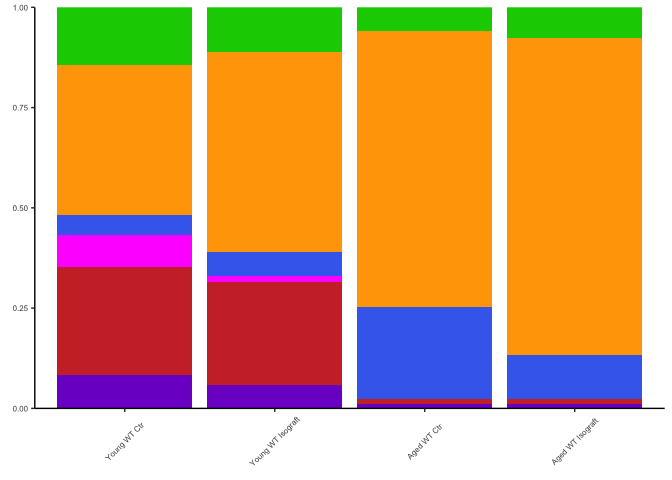
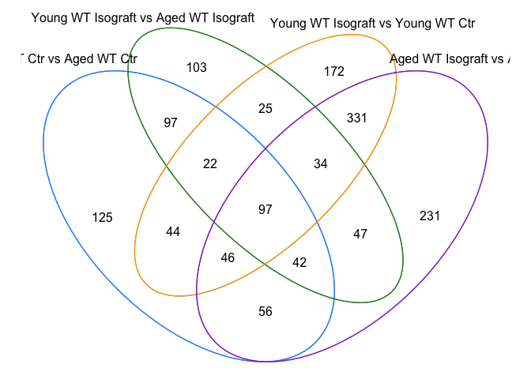
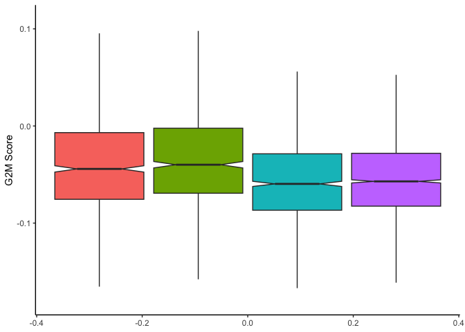
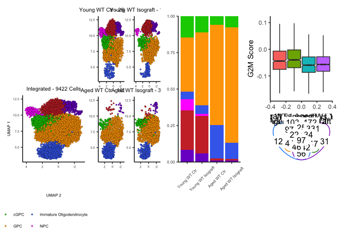
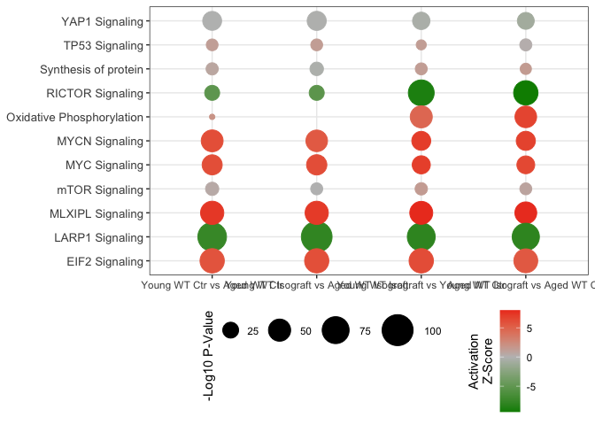
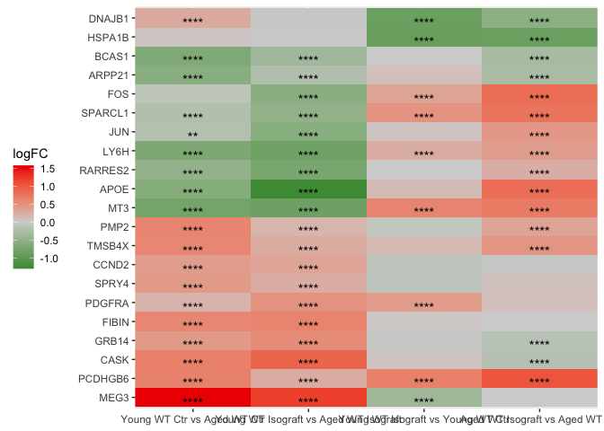
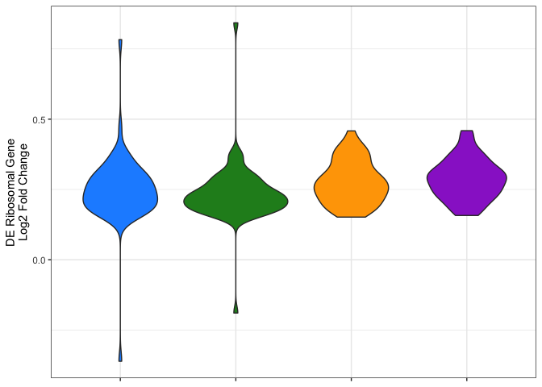
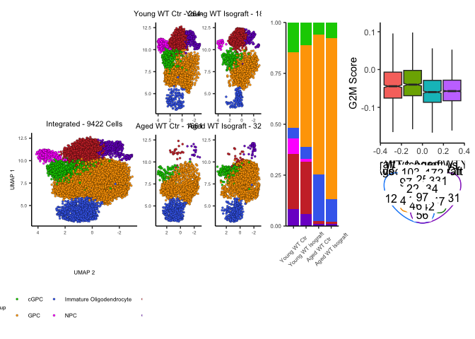
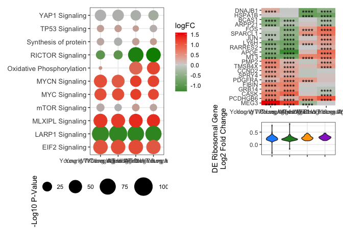

Analysis for generation of Figure 4 - HD Isograft Model
================
John Mariani
12/6/2022

``` r
library(Seurat)
library(scPlottingTools)
library(ggplot2)
library(tidyr)
library(FSA)
library(dplyr)
library(MAST)
library(FSA)
library(plyr)
library(xlsx)
library(patchwork)
library(ggplot2)
library(scales)
library(ggVennDiagram)

`%not in%` <- function(x, table) is.na(match(x, table, nomatch = NA_integer_))


axisTitleSize <- 8
axisTitleSize <- 6
axisTextSize <- 6
labelFont = 6
titleFont = 8
```

# Load and subset pardigm data

``` r
merged <- readRDS("RDS/mergedUpdated.rds")


dimPlotColors <- c(cGPC = "green3", GPC = "orange1", "Immature Oligodendrocyte" = "royalblue2", APC = "brown3", Astrocyte = "purple3", NPC = "magenta")
cellTypeOrder <- c("cGPC", "GPC", "Immature Oligodendrocyte", "NPC", "APC", "Astrocyte")
merged$CellType <- factor(merged$CellType, levels = cellTypeOrder)

g19RescueSubset <- subset(merged, subset = otherGroup %in% c("G19 Neonatal Alone Late", "G19 Neonatal CtrlRescue", "G19 Adult CtrlRescue", "G19 Adult Alone Late"))
g19RescueSubset$Label <- mapvalues(g19RescueSubset$otherGroup, c("G19 Neonatal Alone Late", "G19 Neonatal CtrlRescue", "G19 Adult CtrlRescue", "G19 Adult Alone Late"), c("Aged WT Ctr", "Aged WT Isograft", "Young WT Isograft", "Young WT Ctr"))
g19RescueSubset$Label <- factor(g19RescueSubset$Label, levels = c("Young WT Ctr", "Young WT Isograft", "Aged WT Ctr", "Aged WT Isograft"))
```

# Make Cell Type Stacked Plot

``` r
g19RescueSubsetMeta <- g19RescueSubset@meta.data

g19RescueStackedCelltype <- as.data.frame(table(g19RescueSubsetMeta$Label, g19RescueSubsetMeta$CellType))


stackedPlotIsograft <- ggplot(g19RescueStackedCelltype, aes(fill = Var2, y = Freq, x = Var1))+
  geom_bar(position = "fill", stat = "identity")+
  guides(fill = guide_legend(override.aes = list(size = .6))) +
  #scale_fill_manual(values = palette )+
  labs(y = "Percent", x = "Sort", fill = "Cell Type") + theme_classic() + scale_y_continuous(expand = c(0,0)) + ylab("Percent Identity") + theme(plot.tag = element_text(size = 12), legend.key.size = unit(.6, "lines"), text = element_text(size = labelFont), legend.position = "bottom", axis.text.x =element_text(angle = 45, vjust = .5, hjust = .5)) + xlab(element_blank()) +
  theme(axis.text = element_text(size = axisTextSize), axis.title = element_text(size = axisTitleSize), plot.title = element_text(size = 18), legend.text = element_text(size = 18)) + ylab(element_blank()) +
  scale_fill_manual(values = dimPlotColors) + NoLegend()

stackedPlotIsograft
```

<!-- -->

``` r
#write.xlsx("SourceData/Fig4SourceData.xlsx", sheetName = "Fig4D", x = g19RescueStackedCelltype, row.names = F)
```

# Make DE Venn Diagram

``` r
allDE <- read.delim("DE/allDE.txt")
table(allDE$Label)
```

    ## 
    ##       Aged WT Isograft vs Aged WT Ctr                HD Allograft vs HD Ctr 
    ##                                   884                                  1254 
    ##          WT Allograft vs HD Allograft                WT Allograft vs WT Ctr 
    ##                                   218                                  1105 
    ##                      WT Ctr vs HD Ctr           Young WT Ctr vs Aged WT Ctr 
    ##                                  2661                                   529 
    ## Young WT Isograft vs Aged WT Isograft     Young WT Isograft vs Young WT Ctr 
    ##                                   467                                   771

``` r
isograftVennGenes <- list("Young WT Ctr vs Aged WT Ctr" = allDE[allDE$Label == "Young WT Ctr vs Aged WT Ctr",]$Gene,
                        "Young WT Isograft vs Aged WT Isograft" = allDE[allDE$Label == "Young WT Isograft vs Aged WT Isograft",]$Gene,
                        "Young WT Isograft vs Young WT Ctr" = allDE[allDE$Label == "Young WT Isograft vs Young WT Ctr",]$Gene,
                        "Aged WT Isograft vs Aged WT Ctr" = allDE[allDE$Label == "Aged WT Isograft vs Aged WT Ctr",]$Gene)

isograftVennGenes <- lapply(isograftVennGenes, as.character)


isograftVennGG <- ggVennDiagram(isograftVennGenes, label = "count", label_alpha = 1, ) + theme(legend.position = "none")+ scale_fill_gradient(low="white",high = "white") + scale_colour_manual(values = c("dodgerblue", "forestgreen", "orange", "darkorchid3"))

isograftVennGG
```

<!-- -->

# Make G2M Plot and calculate statistics

``` r
metaMerged <- merged@meta.data

cellTypes <- c("cGPC", "GPC")
names(metaMerged)
```

    ##  [1] "SampleName"        "cellName"          "orig.ident"       
    ##  [4] "nCount_RNA"        "nFeature_RNA"      "percent.mt"       
    ##  [7] "initialCell"       "initialFluor"      "initialTransplant"
    ## [10] "Paradigm"          "initialGroup"      "Capture"          
    ## [13] "initialSampleName" "EGFP_assign"       "mCherry_assign"   
    ## [16] "zero_assign"       "EGFP"              "mCherry"          
    ## [19] "Cell"              "Fluorophore"       "Transplant"       
    ## [22] "Group"             "RNA_snn_res.0.2"   "seurat_clusters"  
    ## [25] "leiden_clusters"   "CellType"          "S.Score"          
    ## [28] "G2M.Score"         "Phase"             "otherGroup"       
    ## [31] "newLabel"          "ngeneson"

``` r
cellCycleDF <- metaMerged[,c("S.Score", "G2M.Score", "Phase", "otherGroup", "CellType", "newLabel", "Transplant", "Cell")]
cellCycleDF <- cellCycleDF[cellCycleDF$CellType %in% cellTypes,]

isograftBoxPlot <- ggplot(cellCycleDF[cellCycleDF$otherGroup %in% c("G19 Adult Alone Late", "G19 Adult CtrlRescue", "G19 Neonatal Alone Late", "G19 Neonatal CtrlRescue"),], aes(fill = newLabel, y = G2M.Score)) + geom_boxplot(notch = T, outlier.shape = NA) +
  ylim(c(-.18,.11)) + theme_classic() + ylab("G2M Score") + NoLegend()

isograftBoxPlot
```

    ## Warning: Removed 509 rows containing non-finite values (`stat_boxplot()`).

<!-- -->

``` r
dunnTest(data = cellCycleDF[cellCycleDF$otherGroup %in% c("G19 Adult Alone Late", "G19 Adult CtrlRescue", "G19 Neonatal Alone Late", "G19 Neonatal CtrlRescue"),],
         method = "bh",
         G2M.Score ~ newLabel)
```

    ## Dunn (1964) Kruskal-Wallis multiple comparison

    ##   p-values adjusted with the Benjamini-Hochberg method.

    ##                            Comparison            Z      P.unadj        P.adj
    ## 1        Old WT Ctr - Old WT Isograft   0.01883207 9.849751e-01 9.849751e-01
    ## 2           Old WT Ctr - Young WT Ctr -13.35940054 1.044015e-40 3.132045e-40
    ## 3      Old WT Isograft - Young WT Ctr -15.91174991 5.252463e-57 3.151478e-56
    ## 4      Old WT Ctr - Young WT Isograft -11.30081983 1.299987e-29 1.949980e-29
    ## 5 Old WT Isograft - Young WT Isograft -13.22413939 6.366172e-40 1.273234e-39
    ## 6    Young WT Ctr - Young WT Isograft   1.49525060 1.348491e-01 1.618189e-01

``` r
sourceData4E <- cellCycleDF[cellCycleDF$otherGroup %in% c("G19 Adult Alone Late", "G19 Adult CtrlRescue", "G19 Neonatal Alone Late", "G19 Neonatal CtrlRescue"),]
sourceData4E <- sourceData4E[,c(2,5,6)]
sourceData4E$cellName <- row.names(sourceData4E)

#write.xlsx("SourceData/Fig4SourceData.xlsx", sheetName = "Fig4E", x = sourceData4E, row.names = F, append = T)
```

# Lay out top of figure

``` r
table(g19RescueSubset$Label)
```

    ## 
    ##      Young WT Ctr Young WT Isograft       Aged WT Ctr  Aged WT Isograft 
    ##              2644              1871              1661              3246

``` r
dim(g19RescueSubset)
```

    ## [1] 38743  9422

``` r
integratedIsograftGG <- DimPlotCustom(g19RescueSubset, group.by = "CellType") + scale_fill_manual(values = dimPlotColors) + ggtitle("Integrated - 9422 Cells") + coord_flip() + scale_y_reverse()
```

    ## Scale for y is already present.
    ## Adding another scale for y, which will replace the existing scale.

``` r
splitIsoograftGG <- DimPlotCustom(g19RescueSubset, group.by = "CellType", split.by = "Label", nrow = 2) & NoLegend() & theme(axis.title = element_blank()) & scale_fill_manual(values = dimPlotColors) & coord_flip() & scale_y_reverse()
```

    ## Scale for y is already present.
    ## Adding another scale for y, which will replace the existing scale.Scale for y is already present.
    ## Adding another scale for y, which will replace the existing scale.Scale for y is already present.
    ## Adding another scale for y, which will replace the existing scale.Scale for y is already present.
    ## Adding another scale for y, which will replace the existing scale.

``` r
splitIsoograftGG[[1]] <- splitIsoograftGG[[1]] + ggtitle("Young WT Ctr - 2644 Cells")
splitIsoograftGG[[2]] <- splitIsoograftGG[[2]] + ggtitle("Young WT Isograft - 1871 Cells")
splitIsoograftGG[[3]] <- splitIsoograftGG[[3]] + ggtitle("Aged WT Ctr - 1661 Cells")
splitIsoograftGG[[4]] <- splitIsoograftGG[[4]] + ggtitle("Aged WT Isograft - 3246 Cells")


(plot_spacer() / integratedIsograftGG) | splitIsoograftGG | stackedPlotIsograft | (isograftBoxPlot / isograftVennGG)
```

    ## Warning: Removed 509 rows containing non-finite values (`stat_boxplot()`).

<!-- -->

# Make IPA Graph

``` r
GO <- read.csv("data_for_import/GO.csv")
GOlevels <- c("WT Ctr vs HD Ctr", "WT Allograft vs HD Allograft", "WT Allograft vs WT Ctr", "HD Allograft vs HD Ctr",
              "Young WT Ctr vs Aged WT Ctr", "Young WT Isograft vs Aged WT Isograft", "Young WT Isograft vs Young WT Ctr", "Aged WT Isograft vs Aged WT Ctr")

goCats <- c("EIF2 Signaling", "LARP1 Signaling", "MLXIPL Signaling", "mTOR Signaling", "MYC Signaling", "MYCN Signaling", "Oxidative Phosphorylation", "RICTOR Signaling", "Synthesis of protein", "TP53 Signaling", "YAP1 Signaling")

GO$Signaling <- factor(GO$Signaling, levels = goCats)
GO$Label <- factor(GO$Label, levels = GOlevels)

isograftGG <- ggplot(GO[GO$Paradigm == "Isograft",]) +
  geom_point(aes(x = Label, y = Signaling, size = Pval, colour = Zscore)) +
  scale_colour_gradient2(low = "green4", mid = "grey", high = "red2", midpoint = 0, guide = guide_colourbar(direction = "vertical", title = "Activation\nZ-Score", title.position = "left", title.hjust = .5)) +
  theme_bw() +
  theme(legend.position = "bottom", axis.title.x = element_blank(), axis.title.y = element_blank(), legend.box = "horizontal", axis.text.y = element_text(size = 10), legend.title = element_text(angle = 90)) +
  labs(size="-Log10 P-Value") + scale_size(range = c(0,12), limits = c(0,100),breaks = c(25,50, 75, 100)) 

isograftGG
```

    ## Warning: Removed 1 rows containing missing values (`geom_point()`).

<!-- -->

``` r
sourceData4G <- GO[GO$Paradigm == "Isograft",]
sourceData4G <- sourceData4G[,c(3,4,5,6,8)]
                   
#write.xlsx("SourceData/Fig4SourceData.xlsx", sheetName = "Fig4G", x = sourceData4G, row.names = F, append = T)
```

# Make HM of curated Genes

``` r
allLogFC <- read.delim("DE/allLogFC.txt")
allLogFC$Label <- factor(allLogFC$Label, levels = GOlevels)


makeHM <- function(genes, paradigm, returnGG = T){
  temp <- allLogFC[allLogFC$Gene %in% genes & allLogFC$Paradigm == paradigm,]
  temp$sig <- ifelse(temp$FDR < 0.0001 & abs(temp$logFC) > 0.15, yes = "****", 
                     ifelse(temp$FDR < 0.001 & abs(temp$logFC) > 0.15, yes = "***",
                            ifelse(temp$FDR < 0.01 & abs(temp$logFC) > 0.15, yes = "**",
                                   ifelse(temp$FDR < 0.05 & abs(temp$logFC) > 0.15, yes = "*", no = ""))))
  tempCluster <- temp[,c("Gene", "Label", "logFC")] %>% pivot_wider(values_from = "logFC", names_from = "Label")
  tempCluster <- data.frame(row.names = tempCluster$Gene, tempCluster[,2:5])
  tempClusterOrder <- hclust(dist(tempCluster))$order
  tempClusterOrder <- row.names(tempCluster)[tempClusterOrder]
  temp$Gene <- factor(temp$Gene, levels = tempClusterOrder)
  if(returnGG == T) {
    return(ggplot(temp, aes(fill = logFC, x = Label, y = Gene)) + geom_tile() + scale_fill_gradient2(low = "forestgreen", mid = "lightgrey", high = "red2", midpoint = 0) +
           scale_x_discrete(expand = c(0,0)) + theme(legend.position = "left", axis.title = element_blank())  + geom_text(aes(label=sig, vjust = 1)))  
  } else {
    return(temp)
  }
}


isograftGenes <- c("FIBIN", "PCDHGB6", "PMP2", "GRB14", "MT3", "TMSB4X", "PDGFRA", "APOE", "HSPA1B", "DNAJB1", "LY6H", "RARRES2", "BCAS1", "JUN", "FOS", "SPARCL1", "NEU", "CASK", "SPRY4", "ARPP21", "MEG3", "CCND2")

isograftHM <- makeHM(isograftGenes, "Isograft", returnGG = T)
isograftHM
```

<!-- -->

``` r
sourceData4H <- makeHM(isograftGenes, "Isograft", returnGG = F)
sourceData4H <- sourceData4H[,c(2,4,5,6,8)]


#write.xlsx("SourceData/Fig4SourceData.xlsx", sheetName = "Fig4H", x = sourceData4H, row.names = F, append = T)
```

# Make Ribosomal Violins

``` r
allDE$Label <- factor(allDE$Label, levels = GOlevels)

riboIsograft <- allDE[allDE$Gene %in% unique(grep(paste(c("RPS", "RPL"),collapse="|"), 
                                                allDE$Gene, value=TRUE)) & allDE$Paradigm == "Isograft",]

riboIsograftGG <- ggplot(riboIsograft, aes(Label, Log2FC)) +
  geom_violin(aes(fill = Label)) + theme_bw() +  theme(legend.position = "none", axis.title.x = element_blank(), axis.text.x = element_blank())  +scale_fill_manual(values = c("dodgerblue", "forestgreen", "orange", "darkorchid3")) +
  ylab("DE Ribosomal Gene\nLog2 Fold Change")

riboIsograftGG
```

<!-- -->

``` r
sourceData4I <- riboIsograft[,c(2:5,7)]
#write.xlsx("SourceData/Fig4SourceData.xlsx", sheetName = "Fig4I", x = sourceData4I, row.names = F, append = T)
```

# Save Top and Bottom of figure

``` r
((plot_spacer() / integratedIsograftGG) | splitIsoograftGG | stackedPlotIsograft | (isograftBoxPlot / isograftVennGG)) + plot_layout(widths = c(1,1,.5,.8))
```

    ## Warning: Removed 509 rows containing non-finite values (`stat_boxplot()`).

<!-- -->

``` r
ggsave("Figures/IsograftTop.pdf", width = 12, height = 6)
```

    ## Warning: Removed 509 rows containing non-finite values (`stat_boxplot()`).

``` r
isograftGG |(isograftHM/ riboIsograftGG) + plot_layout(heights = c(3,1))
```

    ## Warning: Removed 1 rows containing missing values (`geom_point()`).

<!-- -->

``` r
ggsave("Figures/IsograftBottom.pdf", width = 12, height = 6)
```

    ## Warning: Removed 1 rows containing missing values (`geom_point()`).

``` r
sessionInfo()
```

    ## R version 4.1.0 (2021-05-18)
    ## Platform: x86_64-apple-darwin17.0 (64-bit)
    ## Running under: macOS High Sierra 10.13.6
    ## 
    ## Matrix products: default
    ## BLAS:   /Library/Frameworks/R.framework/Versions/4.1/Resources/lib/libRblas.dylib
    ## LAPACK: /Library/Frameworks/R.framework/Versions/4.1/Resources/lib/libRlapack.dylib
    ## 
    ## locale:
    ## [1] en_US.UTF-8/en_US.UTF-8/en_US.UTF-8/C/en_US.UTF-8/en_US.UTF-8
    ## 
    ## attached base packages:
    ## [1] parallel  stats4    stats     graphics  grDevices utils     datasets 
    ## [8] methods   base     
    ## 
    ## other attached packages:
    ##  [1] ggVennDiagram_1.2.2         scales_1.2.1               
    ##  [3] patchwork_1.1.1             xlsx_0.6.5                 
    ##  [5] plyr_1.8.6                  MAST_1.18.0                
    ##  [7] SingleCellExperiment_1.14.1 SummarizedExperiment_1.22.0
    ##  [9] Biobase_2.52.0              GenomicRanges_1.44.0       
    ## [11] GenomeInfoDb_1.28.1         IRanges_2.26.0             
    ## [13] S4Vectors_0.30.0            BiocGenerics_0.38.0        
    ## [15] MatrixGenerics_1.4.1        matrixStats_0.60.0         
    ## [17] dplyr_1.0.7                 FSA_0.9.1                  
    ## [19] tidyr_1.1.3                 ggplot2_3.4.0              
    ## [21] scPlottingTools_0.0.0.9000  sp_1.5-0                   
    ## [23] SeuratObject_4.1.2          Seurat_4.0.3               
    ## 
    ## loaded via a namespace (and not attached):
    ##   [1] igraph_1.2.6           lazyeval_0.2.2         splines_4.1.0         
    ##   [4] listenv_0.8.0          scattermore_0.7        digest_0.6.27         
    ##   [7] htmltools_0.5.1.1      fansi_0.5.0            magrittr_2.0.1        
    ##  [10] tensor_1.5             cluster_2.1.2          ROCR_1.0-11           
    ##  [13] globals_0.14.0         spatstat.sparse_2.0-0  RVenn_1.1.0           
    ##  [16] colorspace_2.0-2       ggrepel_0.9.1          xfun_0.24             
    ##  [19] crayon_1.4.1           RCurl_1.98-1.3         jsonlite_1.7.2        
    ##  [22] progressr_0.10.1       spatstat.data_2.1-0    survival_3.2-11       
    ##  [25] zoo_1.8-9              glue_1.4.2             polyclip_1.10-0       
    ##  [28] gtable_0.3.0           zlibbioc_1.38.0        XVector_0.32.0        
    ##  [31] leiden_0.3.9           DelayedArray_0.18.0    dunn.test_1.3.5       
    ##  [34] future.apply_1.7.0     abind_1.4-5            DBI_1.1.1             
    ##  [37] miniUI_0.1.1.1         Rcpp_1.0.7             viridisLite_0.4.0     
    ##  [40] xtable_1.8-4           units_0.8-1            reticulate_1.20       
    ##  [43] spatstat.core_2.3-0    proxy_0.4-26           htmlwidgets_1.5.3     
    ##  [46] httr_1.4.2             RColorBrewer_1.1-2     ellipsis_0.3.2        
    ##  [49] ica_1.0-2              farver_2.1.0           pkgconfig_2.0.3       
    ##  [52] rJava_1.0-6            uwot_0.1.10            deldir_1.0-6          
    ##  [55] utf8_1.2.2             labeling_0.4.2         tidyselect_1.1.1      
    ##  [58] rlang_1.0.6            reshape2_1.4.4         later_1.2.0           
    ##  [61] munsell_0.5.0          tools_4.1.0            cli_3.4.1             
    ##  [64] generics_0.1.0         ggridges_0.5.3         evaluate_0.14         
    ##  [67] stringr_1.4.0          fastmap_1.1.0          yaml_2.2.1            
    ##  [70] goftest_1.2-2          knitr_1.33             fitdistrplus_1.1-5    
    ##  [73] purrr_0.3.4            RANN_2.6.1             pbapply_1.4-3         
    ##  [76] future_1.21.0          nlme_3.1-152           mime_0.11             
    ##  [79] compiler_4.1.0         rstudioapi_0.13        plotly_4.9.4.1        
    ##  [82] png_0.1-7              e1071_1.7-12           spatstat.utils_2.2-0  
    ##  [85] tibble_3.1.3           stringi_1.7.3          highr_0.9             
    ##  [88] rgeos_0.5-9            lattice_0.20-44        Matrix_1.5-1          
    ##  [91] classInt_0.4-8         vctrs_0.5.1            pillar_1.6.2          
    ##  [94] lifecycle_1.0.3        spatstat.geom_2.4-0    lmtest_0.9-38         
    ##  [97] RcppAnnoy_0.0.19       data.table_1.14.0      cowplot_1.1.1         
    ## [100] bitops_1.0-7           irlba_2.3.3            httpuv_1.6.1          
    ## [103] R6_2.5.0               promises_1.2.0.1       KernSmooth_2.23-20    
    ## [106] gridExtra_2.3          parallelly_1.27.0      codetools_0.2-18      
    ## [109] MASS_7.3-54            assertthat_0.2.1       xlsxjars_0.6.1        
    ## [112] withr_2.5.0            sctransform_0.3.2      GenomeInfoDbData_1.2.6
    ## [115] mgcv_1.8-42            grid_4.1.0             rpart_4.1-15          
    ## [118] class_7.3-19           rmarkdown_2.9          Rtsne_0.15            
    ## [121] sf_1.0-9               shiny_1.6.0
