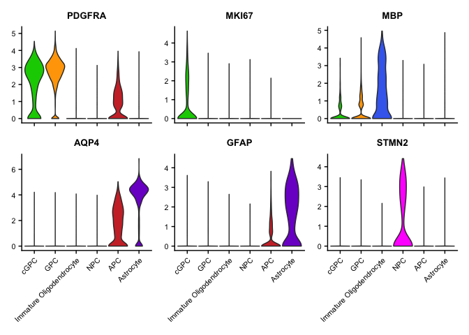
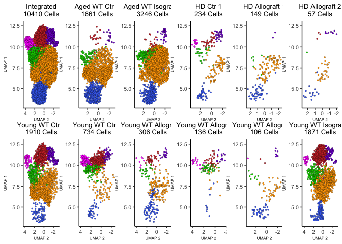
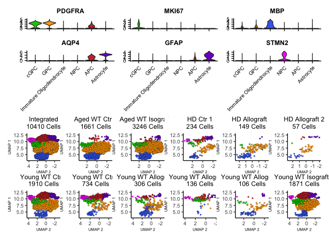

Generation of scRNA-seq Supplemental Figure
================
John Mariani
12/6/2022

``` r
library(Seurat)
library(plyr)
library(ggplot2)
library(patchwork)
library(scPlottingTools)
```

# Load and label data

``` r
dimPlotColors <- c(cGPC = "green3", GPC = "orange1", "Immature Oligodendrocyte" = "royalblue2", APC = "brown3", Astrocyte = "purple3", NPC = "magenta")


merged <- readRDS("RDS/mergedUpdated.rds")
cellTypeOrder <- c("cGPC", "GPC", "Immature Oligodendrocyte", "NPC", "APC", "Astrocyte")
merged$CellType <- factor(merged$CellType, levels = cellTypeOrder)


supplementalLabels <- data.frame(SampleName = unique(merged$SampleName), supLabel = c("Young WT Ctr 1", "Young WT Isograft 1","Young WT Ctr 2",
                                                                                      "Young WT Allograft 1", "Young WT Allograft 2", "Young WT Allograft 3",
                                                                                      "Aged WT Ctr 1", "Aged WT Isograft 1", "HD Ctr 1",
                                                                                      "HD Allograft 1", "HD Allograft 2"))
supplementalLabels$SampleName
```

    ##  [1] "G19 EGFP Adult Alone Late 1"       "G19 EGFP Adult CtrlRescue 3"      
    ##  [3] "G19 mCherry Adult Alone Late 7"    "G19 mCherry Adult Rescue 10"      
    ##  [5] "G19 mCherry Adult Rescue 11"       "G19 mCherry Adult Rescue 9"       
    ##  [7] "G19 mCherry Neonatal Alone Late 2" "G19 mCherry Neonatal CtrlRescue 3"
    ##  [9] "G20 EGFP Neonatal Alone Late 8"    "G20 EGFP Neonatal Rescue 10"      
    ## [11] "G20 EGFP Neonatal Rescue 11"

``` r
merged$supLabel <- mapvalues(merged$SampleName, from = supplementalLabels$SampleName, to = supplementalLabels$supLabel)

merged$supLabel <- factor(merged$supLabel, levels = c("Aged WT Ctr 1", "Aged WT Isograft 1", "HD Ctr 1", "HD Allograft 1", "HD Allograft 2", "Young WT Ctr 1", "Young WT Ctr 2", "Young WT Allograft 1", "Young WT Allograft 2", "Young WT Allograft 3", "Young WT Isograft 1"))


extendedTheme <- theme(axis.text = element_text(size = 8), plot.title = element_text(size = 10))
```

# Plot Figure

``` r
supDims <- DimPlotCustom(merged, split.by = "supLabel", nrow = 2, group.by = "CellType") & NoLegend() & scale_fill_manual(values = dimPlotColors) & extendedTheme & coord_flip() & scale_y_reverse()
```

    ## Scale for y is already present.
    ## Adding another scale for y, which will replace the existing scale.Scale for y is already present.
    ## Adding another scale for y, which will replace the existing scale.Scale for y is already present.
    ## Adding another scale for y, which will replace the existing scale.Scale for y is already present.
    ## Adding another scale for y, which will replace the existing scale.Scale for y is already present.
    ## Adding another scale for y, which will replace the existing scale.Scale for y is already present.
    ## Adding another scale for y, which will replace the existing scale.Scale for y is already present.
    ## Adding another scale for y, which will replace the existing scale.Scale for y is already present.
    ## Adding another scale for y, which will replace the existing scale.Scale for y is already present.
    ## Adding another scale for y, which will replace the existing scale.Scale for y is already present.
    ## Adding another scale for y, which will replace the existing scale.Scale for y is already present.
    ## Adding another scale for y, which will replace the existing scale.

``` r
integratedSupDim <- DimPlotCustom(merged, group.by = "CellType") & NoLegend() & scale_fill_manual(values = dimPlotColors) & extendedTheme & coord_flip() & scale_y_reverse() & ggtitle("Integrated\n10410 Cells")
```

    ## Scale for y is already present.
    ## Adding another scale for y, which will replace the existing scale.

``` r
supViolins <- VlnPlot(merged, group.by = "CellType", c("PDGFRA", "MKI67", "MBP", "AQP4", "GFAP", "STMN2"), pt.size = 0, cols = dimPlotColors) & theme(axis.title = element_blank()) & extendedTheme
                                                                                                                                                  

supViolins[[1]] <- supViolins[[1]] + theme(axis.text.x = element_blank())
supViolins[[2]] <- supViolins[[2]] + theme(axis.text.x = element_blank())
supViolins[[3]] <- supViolins[[3]] + theme(axis.text.x = element_blank())

supViolins
```

<!-- -->

``` r
table(merged$supLabel)
```

    ## 
    ##        Aged WT Ctr 1   Aged WT Isograft 1             HD Ctr 1 
    ##                 1661                 3246                  234 
    ##       HD Allograft 1       HD Allograft 2       Young WT Ctr 1 
    ##                  149                   57                 1910 
    ##       Young WT Ctr 2 Young WT Allograft 1 Young WT Allograft 2 
    ##                  734                  306                  136 
    ## Young WT Allograft 3  Young WT Isograft 1 
    ##                  106                 1871

``` r
for(i in 1:11){
  supDims[[i]]$labels$title <- paste0(supDims[[i]]$labels$title, "\n", table(merged$supLabel)[[i]], " Cells")
}

allDims <- (integratedSupDim | supDims[[1]] | supDims[[2]] | supDims[[3]] | supDims[[4]] | supDims[[5]]) /
  (supDims[[6]] | supDims[[7]] | supDims[[8]] | supDims[[9]] | supDims[[10]] | supDims[[11]])

allDims
```

<!-- -->

``` r
((supViolins / allDims) + plot_layout(heights = c(1,2)))
```

<!-- -->

``` r
ggsave("Figures/SupplementalData.pdf", width = 12, height = 9)
```

``` r
sessionInfo()
```

    ## R version 4.1.0 (2021-05-18)
    ## Platform: x86_64-apple-darwin17.0 (64-bit)
    ## Running under: macOS High Sierra 10.13.6
    ## 
    ## Matrix products: default
    ## BLAS:   /Library/Frameworks/R.framework/Versions/4.1/Resources/lib/libRblas.dylib
    ## LAPACK: /Library/Frameworks/R.framework/Versions/4.1/Resources/lib/libRlapack.dylib
    ## 
    ## locale:
    ## [1] en_US.UTF-8/en_US.UTF-8/en_US.UTF-8/C/en_US.UTF-8/en_US.UTF-8
    ## 
    ## attached base packages:
    ## [1] stats     graphics  grDevices utils     datasets  methods   base     
    ## 
    ## other attached packages:
    ## [1] scPlottingTools_0.0.0.9000 patchwork_1.1.1           
    ## [3] ggplot2_3.4.0              plyr_1.8.6                
    ## [5] sp_1.5-0                   SeuratObject_4.1.2        
    ## [7] Seurat_4.0.3              
    ## 
    ## loaded via a namespace (and not attached):
    ##   [1] Rtsne_0.15            colorspace_2.0-2      deldir_1.0-6         
    ##   [4] ellipsis_0.3.2        ggridges_0.5.3        rstudioapi_0.13      
    ##   [7] spatstat.data_2.1-0   farver_2.1.0          leiden_0.3.9         
    ##  [10] listenv_0.8.0         ggrepel_0.9.1         fansi_0.5.0          
    ##  [13] codetools_0.2-18      splines_4.1.0         knitr_1.33           
    ##  [16] polyclip_1.10-0       jsonlite_1.7.2        ica_1.0-2            
    ##  [19] cluster_2.1.2         png_0.1-7             rgeos_0.5-9          
    ##  [22] uwot_0.1.10           shiny_1.6.0           sctransform_0.3.2    
    ##  [25] spatstat.sparse_2.0-0 compiler_4.1.0        httr_1.4.2           
    ##  [28] assertthat_0.2.1      Matrix_1.5-1          fastmap_1.1.0        
    ##  [31] lazyeval_0.2.2        cli_3.4.1             later_1.2.0          
    ##  [34] htmltools_0.5.1.1     tools_4.1.0           igraph_1.2.6         
    ##  [37] gtable_0.3.0          glue_1.4.2            RANN_2.6.1           
    ##  [40] reshape2_1.4.4        dplyr_1.0.7           Rcpp_1.0.7           
    ##  [43] scattermore_0.7       vctrs_0.5.1           nlme_3.1-152         
    ##  [46] progressr_0.10.1      lmtest_0.9-38         xfun_0.24            
    ##  [49] stringr_1.4.0         globals_0.14.0        mime_0.11            
    ##  [52] miniUI_0.1.1.1        lifecycle_1.0.3       irlba_2.3.3          
    ##  [55] goftest_1.2-2         future_1.21.0         MASS_7.3-54          
    ##  [58] zoo_1.8-9             scales_1.2.1          spatstat.core_2.3-0  
    ##  [61] promises_1.2.0.1      spatstat.utils_2.2-0  parallel_4.1.0       
    ##  [64] RColorBrewer_1.1-2    yaml_2.2.1            reticulate_1.20      
    ##  [67] pbapply_1.4-3         gridExtra_2.3         rpart_4.1-15         
    ##  [70] stringi_1.7.3         highr_0.9             rlang_1.0.6          
    ##  [73] pkgconfig_2.0.3       matrixStats_0.60.0    evaluate_0.14        
    ##  [76] lattice_0.20-44       ROCR_1.0-11           purrr_0.3.4          
    ##  [79] tensor_1.5            labeling_0.4.2        htmlwidgets_1.5.3    
    ##  [82] cowplot_1.1.1         tidyselect_1.1.1      parallelly_1.27.0    
    ##  [85] RcppAnnoy_0.0.19      magrittr_2.0.1        R6_2.5.0             
    ##  [88] generics_0.1.0        DBI_1.1.1             withr_2.5.0          
    ##  [91] mgcv_1.8-42           pillar_1.6.2          fitdistrplus_1.1-5   
    ##  [94] survival_3.2-11       abind_1.4-5           tibble_3.1.3         
    ##  [97] future.apply_1.7.0    crayon_1.4.1          KernSmooth_2.23-20   
    ## [100] utf8_1.2.2            spatstat.geom_2.4-0   plotly_4.9.4.1       
    ## [103] rmarkdown_2.9         grid_4.1.0            data.table_1.14.0    
    ## [106] digest_0.6.27         xtable_1.8-4          tidyr_1.1.3          
    ## [109] httpuv_1.6.1          munsell_0.5.0         viridisLite_0.4.0
